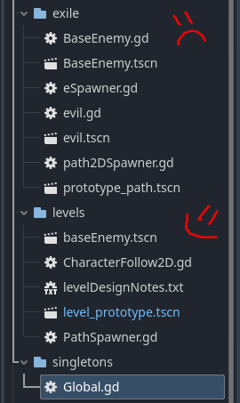
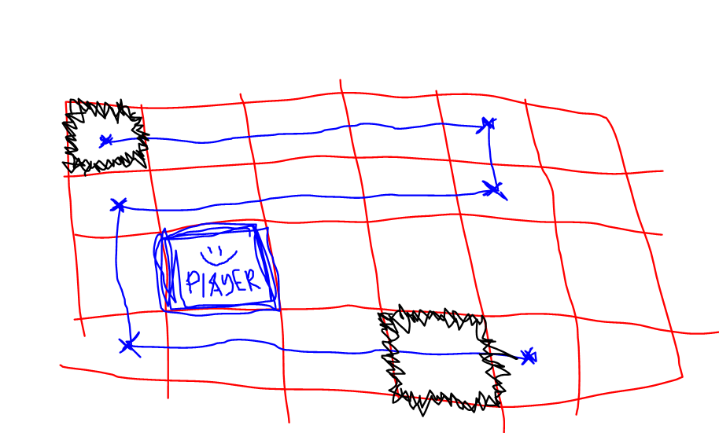
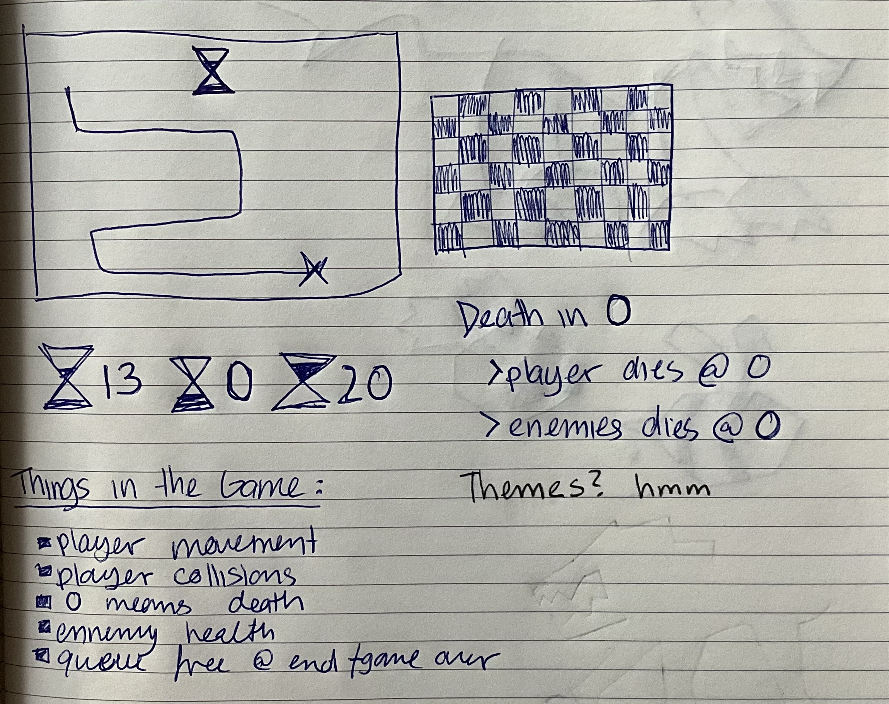
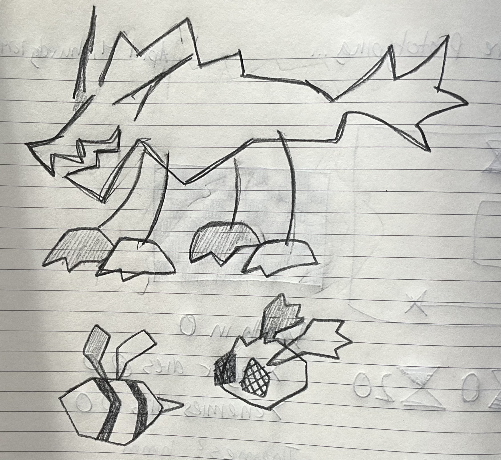
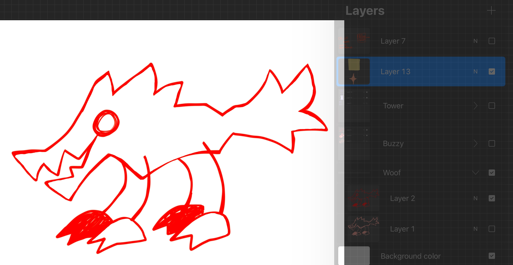

# Rev's Design Journal
## Index
* [Game Analysis](#game-analysis)
* [Conceptualizing](#conceptualizing)

* [Prototyping Stage 1](#prototypingstage1)

* [Prototyping Stage 2](#prototypingstage2)

* [Prototyping Stage 3](#prototypingstage3)

* [Prototyping Stage 4](#prototypingstage4)

* [Final Design Journal](#FinalDesignJournal)

## Game Analysis
### *Tiny Rogues!*
My current obsession!!\
[link to steam page...](https://store.steampowered.com/app/2088570/Tiny_Rogues/)

I got into it a year ago, and then recently went back due to a huge content update. It's a one man show game that's still in early access, with a lot of plans for future content. In brief, it’s a bullet hell roguelite where the player descends 10 levels to kill a final boss. Fun no?

**Meta Progression:**\
One of my favorite things about the game is the “meta progression”. On first launch, Tiny Rogues was fresh off of the Vampire Survivors hype, including a similar meta progression chart. I wasn’t a really big fan of it the first time I played, since it was just used to make the roguelike “easier”. But… this update… completely reworked the chart. Now turned into a tree, there are 4 quadrants that branch from a common center, each offering different “meta progression” style rewards, ranging from making the game easier to harder! Each quadrant focuses on its own set of skill upgrades: Challenges (hard mode), Luck (easy mode), Loot, Shop. Each quadrant also functions as its own mini tree, meaning that you can only reach the end of the skill tree by unlocking nodes that connect to the ones before it. The element that makes this system great, however, is the fact that any skill selected can be unselected for free, with no external cost to the player. This design decision means that the player can easily customize every single run depending on the challenges they want to undertake! 

Another aspect of this skill tree is the fact that “easy mode” is not immediately unlockable, needing around 3-4 levels of progress within the game. This subtly forces the player to at least try their hand at the game normally, and by that point they should learn enough of it to not need an easier game mode! I appreciate the option still being there though. 

**Accessibility:**\
Honorable mention to the graphic’s accessibility. Tiny Rogues uses two big visual filters to give the screen a vhs effect. This, in turn, means that light sensitive people can’t play it due to how much the screen shake, the blown up screen and the glitch lines interact with the game's projectiles. In the settings, RubyDev has implemented a slider for the players to customize how present these filters are (from all of them to none of them)!

## Conceptualizing

*My ideation process?* 

I instantly knew I wanted to make a tower defense game. It was the rest of the concept I had to really work on. The main design values I tried to keep in mind were experience, decision-making and strategy. There's something to be said about card games, tower defense, turn based and puzzle games, where each decision you make is important.
*The question is how can I mix them all together?*

My 3 favorite ideas were as follows:
1) Card based tower defense
2) Turn based tower defense (ie not real time)
3) Your currency is == to your lives

As for my main game inspirations?
Isle of Arrows, Wildfrost, WitchHand, Bloons TD6, Forward: Escape the Fold, Baba Is You, Superhot

## PrototypingStage1

The First Stage of the prototype process. :) 

#### *What was your idea*

My idea is a turn based tower defense game where the player moves the end goal of the map.  There is only 1 tower the player can place/control. The enemies only advance the path every time the player moves their tower. The player then uses the one tower to attack, and depending on different power-up cards you place, it changes the tower’s ability to deal damage. If the tower loses all health points, it’s game over. 

#### *What specific questions where you trying to answer (goals)*

“How can I innovate on a base tower defense game?”
“What happens when enemies only advance when the player moves?”

#### *Was is a look/feel, role or implementation prototype*

Definitely a look/feel prototype, since I was trying to get the flow of the gameplay figured out. I had scribbled on a page with cards and paper tokens in which people could move around with the following rules:

- You may only move 1 step forward in each cardinal direction (no sideways)
- Every time you move, the enemies advance 1
- Each action moves ”time” forward 
- Play a card to upgrade your main tower (defense gives 3 shield, attack add 5 damage)
- You start with 3 health

#### *What fidelity are you dealing with*

I'm definetly working with Low Fidelity. I cant worry about graphics yet in order to properly hammer out the mechanics. Although... I'm really liking the idea of having a papercraft-esque vibe to the artwork...

#### *What did you learn*

Well… im starting to understand why some devs insist on not wanting to switch game engines… It's all about personal preference in the end. Maybe i'm just too used to Godot’s responsiveness and lightweight UI, but i've been genuinely fighting with myself over Unity
After talking about it with some people, while going over my prototype, I've come to the consensus that it's better to actually make something and hand it in rather than wallow in turmoil. For the rest of this project, I'll be switching over to godot. It might take a bit more work to unravel my ideas to make them work on there but i think it's for the best long term. 

I also need to remind myself that theres no right way to go about prototyping. I'm supposed to fail, and then learn from it. Nothing is perfect on the first try. I gotta remember all that...

#### *What are the next steps?*

Well, for one, I have to retranslate all my plans over to Godot, which won't take very long imo. 
Here ive broken down the elements I want for sure in my game:
- Movable main character, only up,down,left,right
- Enemy 
- Main path for enemies to follow
- Time/Move counter 
- Health… (do i want health == attack? health == currency? All of the above? Still gotta figure it out…)

## PrototypingStage2

FREAKEN EUREKA 
OH MY GOD :SOB: 

first of all, moving to godot was the best decision of my life. I was able to set up my basics in a day, compared to the basics i have even yet to understand in unity... 

Second of all, tutorials really are godsent sometimes. This last week and a half ive spent so much time trying to understand how to spawn enemies, and how to get them to follow a path, classic tower defence stuff. i had to try so many times until i got it, but it works PERFECTLY in the end. Here is a picture of all my attempts ive exiled in a jail folder: 

In terms of player controls, i have the 4 directional movement down, and thats including the start of a global counter system to turn the game turn based. Things are finally lining up. its so real. im so excited. its a lot of work :sob:

BUT IT WORKS
IT FINALLY WORKS OH MY GOD

What it does so far:
- 4 directional player movement in a grid 
- enemy spawn with customizable waves
- enemy movement that relies on player moving first 

Things to do:
- player health system
- enemy damage?
- end goal to defend 

## PrototypingStage3

I have to face the music. What I have made is not very fun...
It's a strange experience to be told to fail, and an even stranger on to learn how to be okay with failure. 
Did I manage to make a fun prototype? No.
Did I learn a lot? Yes!

After talking with the prof about it, I feel a lot more confident with my work :)
I'm gonna keep at it, keep working on the protype to figure out the final kinks in the game logic. 

Its a shame that this idea i've had forever doesnt really work, but I guess the whole purpose of doing these prototypes is to figure out what works and what doesn't. Within those terms, I'd consider myself pretty on track.

Some sketches for grid placement ideas:

THE GLOBAL COUNTER:
I absolutly had to make myself a graph to figure out how the counter system works...
Once I did tho, it suddenly started to click.

## PrototypingStage4

Here is a culmination of the notes I took within godot itself (contained in a random txt file called levelDesignNotes.txt) 

~~~~~~~~~~~~~~~~~~~~~~~~~~~
:) 

Design Notes:
-------------
1. when creating/putting down things, make sure u have both grid snap AND smart snap on
2. current tiles are at 64x64, if changed make sure to also change it for the player

Base Necessities Checklist:
---------------------------
	DONE - player can collide into enemy but cant move into them
		IMPORTANT == collisions need to  be specifically set to match the 64x64 tile constraints 
					 this means, enemies gotta be in the middle of that 64x64, and be mindful of the path 
					 (make chart for tile placement :) )
	DONE - player can cross path so long as no enemy ontop
	DONE - any action (ie moving, playing cards, upgrading) moves enemy forward
	
	- enemy health
	- end goal health 
	- game over screen
	- main menu
	- global countdown 

Quality of Life Checklist:
--------------------------
	- counter that fills up before ennemi movies
	- visible enemy health
	- visible player health?

BRAIN ROT
=========
	is the player part of the ending? or is that a seperate thing
	goal to defeat enemies before counter drops to 0 or player dies? 
	enemies do timer damage
	do i even want health on the main tower? 
	
	lost turn per enemy? enemy stays there for x turn, each turn an enemy is there they make u lose a timer\
	> incentive to kill the ones in the back as much as the front
	
	> split paths? just in case...
	
	> check out game zipper, if its not fun, then what can u do about it
	> how to make it visually see whats going on lmfao
~~~~~~~~~~~~~~~~~~~~~~~~~~~

> gathering resources for making the presentation
Spent some time preparing for the final showcase, definetly leaning on the whole "i experimented and it failed!" angle. 
    --> I added the presentation in the Final Game Prototype folder! so everybody can see it in all its glory!!!

> simple and quick art assets to add some type of *vibe* to the prototype
Made a tower and bug enemy, decided to not to make the wolf enemy due to time constraints, but damn would it have looked good...
Here are some doodles and the final results:

 

## FinalDesignJournal

> notes from classmates!
Here are the notes I ended up taking regarding my prototype :)
Thank youuuuu feedback!!!

- consider: switching genres... lean into puzzles? maybe a tower defence puzzle where you have limited movements where u can place/replace towers in specific slots.
- must pivot goal idea, its a rudamentary foundation that can be expanded upon. maybe as yourself another goal question? maybe try something else completly different?
- consider: towers that move? 
- consider: towers that break down, gotta go around and fix them up

> my thoughts on this entire process 
(how it really just builds up, how its so hard to let myself fail... and the acceptance that comes with it...)

It was an interesting experience. I think this class definetly helped normalize failure? I feel less afraid of trying out things even if they dont originally pan out the way I wanted them to.

My next steps forward is figuring out how to change goals and think of new questions in the face of a protytpe not functioning. I have a lot to learn, still. I feel like I'm leaving the class having learnt more about myself than anything else... Is that a good thing? Who knows :shrug: